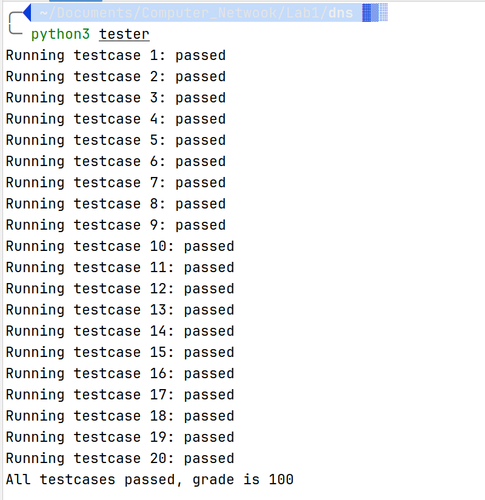
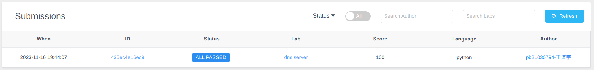

# 计算机网络实验一（DNS）实验报告

> 姓名：王道宇
>
> 学号：PB21030794

## 实验目的

本实验需要实现一个搭建在 OpenNetLab 上的 DNS 服务器，该服务器具备以下功能：

- 拦截特定域名
- 返回域名对应的 IP 地址

## 代码解释

本实验只需要补全 server.py 中的一部分代码即可：

```python
    def recv_callback(self, data: bytes):
        """
        TODO: 处理DNS请求，data参数为DNS请求数据包对应的字节流
        1. 解析data得到构建应答数据包所需要的字段
        2. 根据请求中的domain name进行相应的处理:
            2.1 如果domain name在self.url_ip中，构建对应的应答数据包，发送给客户端
            2.2 如果domain name不再self.url_ip中，将DNS请求发送给public DNS server
        """
        recvdp = DNSPacket(data)
        if recvdp.QR == 0:
            if recvdp.name in self.url_ip.keys():
                if self.url_ip[recvdp.name] == "0.0.0.0":
                    # generate a reply error data
                    resp = recvdp.generate_response(
                        self.url_ip[recvdp.name], True)
                else:
                    # generate response data
                    resp = recvdp.generate_response(
                        self.url_ip[recvdp.name], False)
            else:
                # send query message to public DNS server
                # receive data from public server
                self.server_socket.sendto(data, self.name_server)
                resp, server_address = self.server_socket.recvfrom(1024)
            self.send(resp)
            # send data to client
```

该函数需要处理来自 client 的 DNS 请求，该请求以字节流的方式传入，仿照 client 中的处理方式，在第 9 行使用传入的 data 作为参数实例化了一个 DNSPacket 对象 recvdp ，在实例化时会调用 DNSPacket 中的 __init__ 方法，自动从加密后的 data 中提取信息。

而 recvdp 中的 QR 属性表示了该 DNS 请求是查询（Query）还是响应（Response），在这里我们只处理 DNS 查询，所以需要 recvdp.QR 为 0。

在第 11 行判断了请求的域名是否在本地有保存，并且当本地有保存时，若对应域名的 IP 地址是 "0.0.0.0" 时，需要被拦截，当本地无保存时，需要将请求发送到上层 DNS 服务器，并且接受其应答。

为了区分是否拦截，我们在生成响应时使用 bool 型变量 intercepted 进行区分，当 intercepted 为 True 时，表示我们需要拦截，反之亦然。

为了请求上层 DNS 服务器，我们使用套接字编程中的 sendto 方法和recvfrom 方法，通过 sendto 将数据包发送给公共 DNS 服务器，同时使用 recvfrom **阻塞**地接收来自公共 DNS 服务器的结果。

最终，在第2行，将生成的响应信息发送回 client。

## 实验结果展示

- 本机 tester 结果

  

- onl 远程评估结果

  

