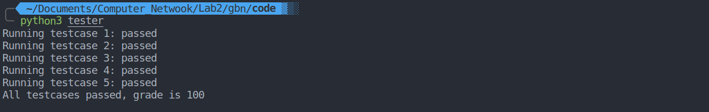
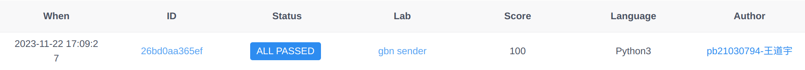

# 计算机网络实验二（GBN）实验报告

> 姓名： 王道宇
>
> 学号： PB21030794

## 实验目的

本实验需要实现一个搭建在 OpenNetLab 上的使用 GBN 协议的发送端。这个发送端需
要将一个字符串中的每个字符封装为分组发送给接收端，并且遵循 GBN 协议：

- 开始时发送滑动窗口内所有可以发送的分组。
- 每发送一个分组，保存该分组在缓冲区中，表示已发送但还未被确认。
- 缓冲区使用一个定时器，当定时器超时的时候，重新发送缓冲区中的所有分组。
- 当收到接收方的确认后，判断该确认是否有效。如果无效的话，什么也不做；如果
  有效的话，采取累计确认，移动滑动窗口，将已经被确认的分组从缓冲区中删除，
  并且发送接下来可以发送的分组，重置定时器。

## 代码解释

本实验需要填写 `sender.py` 中的三个函数 run，put 和 time_callback

### run 函数

实质上，run 函数是一种冷启动过程，相当于发送端刚开始发送 message 信息，功能包括

- 检测滑动窗口是否已满来产生分组，并发送滑动窗口内所有可以发送的分组
- 每发送一个分组，保存分组到缓冲区中，表示已发送未确认
- 在规定的时机重置定时器

代码解释

```python
def run(self, env: Environment):
	# 检测滑动窗口是否已满
    while self.seqno < self.seqno_start + selfwindow_size:
        # 创建分组并发送
        packet = self.new_packet(
            self.seqno, self.message[self.absno]
        ) 
        self.send_packet(packet)
        # 将发送的分组加入缓冲区
        self.outbound.append(packet)
        # 对应序号自增来进行下面的分组和发送
        self.seqno += 1
        self.absno += 1
        # 同样要注意的是，当 message 长度没有一个窗口时，在冷启动阶段就需要结束
        if self.absno == len(self.message):
            break
        
    # 重启计时器
    self.timer.restart(self.timeout)
    """
    通过`self.finish_channel.get()`获取状态
    即当`self.finish_channel.put(True)`时发送端模拟束
    """
    yield self.finish_channel.get()
```

### put 函数

继冷启动之后，需要继续发送下面的分组，这时就需要使用 put 函数。

put 函数需要实现的功能有：

- 检查收到的 ACK
- 采取累积确认，移动滑动窗口，并发送接下来可以发送的分组
- 重置定时器
- 检查是否发送完message，若发送完毕则告知结束

代码解释

```python
def put(self, packet: Packet):
    """从接收端收到ACK"""
    ackno = packet.packet_id 
    """
    判断 ackno 是否有效条件相对复杂，包括两个层面
    1. 当前 ackno 与起始序号模 2^k 下的差是否小于窗口小
    2. 当前 ackno 是否比当前还未传的序号模 2^k 下小
    """
    if (ackno + self.seqno_range - selfseqno_start) % self.seqno_range < selfwindow_size and (self.seqno + self.seqno_range -ackno) % self.seqno_range > 0:
        # 采用累计确认的方式将所有的已确认的包从缓存中移除
        for _ in range(0, 1 + (ackno + selfseqno_range - self.seqno_start) % selfseqno_range):
            self.outbound.popleft()
    # 起始序号通过 ackno 更新
    self.seqno_start = (ackno + 1) % selfseqno_range
    # 与 run 中一样将所有窗口的有效分组全部打包发送
    while ((self.seqno + self.seqno_range - selfseqno_start) % self.seqno_range < selfwindow_size and
           self.absno < len(self.message)):
        packet = self.new_packet(self.seqno, selfmessage[self.absno])
        self.send_packet(packet)
        self.outbound.append(packet)
        self.seqno = (self.seqno + 1) % selfseqno_range
        self.absno += 1
        if self.absno == len(self.message):
            break
	"""
	全部传完的条件也较为复杂
	1. 首先 absno 需要到 message 的最后一位
	2. 其次 缓存中所存的所有分组要全部发完
	全部传完需要通知 finish_channel 传完
	"""
    if self.absno == len(self.message) and not len(self.outbound):
        self.finish_channel.put(True)
    """
    若没有传完，那么重启计时器
    """
    else:
            self.timer.restart(self.timeout)
```

### time_callback 函数

这是处理超时未受到 ACK 的处理：

该函数需要实现如下功能：

- 超时重传所有已发送但还未被确认过的分组
- 注意这个函数结束会自动重置定时器，不用手动重置

代码解释

```python
def timeout_callback(self):
    
    self.dprint("timeout")
    # 重新传所有在缓存中的分组
    for packet in self.outbound:
        self.send_packet(packet)
```

## 实验结果展示

- 本机 tester 结果

  

-  onl 远程评估结果

  